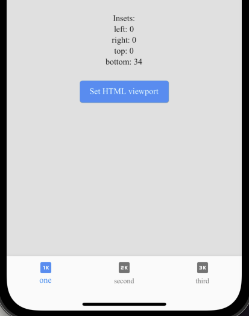

# web_insets

## Features
***
WebInsets gives values of browser insets.




Has two modes:
* "on demand" - get actualy insets on build method
* listening insets changes by a subscription

It resolves this issue https://github.com/flutter/flutter/issues/84833. 

Uses this NPM package https://www.npmjs.com/package/safe-area-insets (version 1.4.1)

## Getting started
***
1. Connect minified js bundle to index.html your project one of three ways:
    * Just using CDN source
    ```html
    <!-- /web/index.html -->
    <head>
        ...
        <script src="https://unpkg.com/safe-area-insets/out/umd/index.min.js"></script>
    ```
    or 

    * <p><a href="https://github.com/AndX2/web_insets.git" download>Download</a> bundle and copy it to your web files
    ```html
    <!-- /web/index.html -->
    <head>
        ...
        <script src="index.min.js"></script>
    ```

    or 

    * Clone NPM [repository](https://github.com/zhetengbiji/safeAreaInsets.git), build it yourself and follow way #2 

2. Call the viewport attribute setter once before using the package first time. Main method for example.
    ```dart
    // lib/main.dart

        void main() {
            //...
            /// Set html attribute viewport to viewport-fit=cover
            WebInsets().initializeViewPort();
            //...
            }
    ```
    ### Notice:
    Package has implementation for web and stub getters for other platforms. You can call any method without platform check. Stub will do nothing or return zero value for getter if the platform is not web. 

## Usage
***
1. On demand:
    ```dart
        ...
        @override
        Widget build(BuildContext context) {
            final bottom = WebInsets().bottom;
            ...
    ```
2. Subscription:
    ```dart
        class _MyHomePageState extends State<MyHomePage> {
            late WebInsetsListener _listener;

            @override
            void initState() {
              super.initState();
              WebInsets().initializeViewPort();
              _listener = WebInsetsListener(
                (EdgeInsets insets) {...},
              );
            }

            @override
            void dispose() {
              _listener.dispose();
              super.dispose();
            }

    ```

## Additional information
***
The package follows this [solution](https://github.com/flutter/flutter/issues/84833#issuecomment-890540239)

Used NPM package [safe-area-insets](https://www.npmjs.com/package/safe-area-insets), [repository](https://github.com/zhetengbiji/safeAreaInsets)

More information about [Designing Websites for iPhone X](https://webkit.org/blog/7929/designing-websites-for-iphone-x/)
